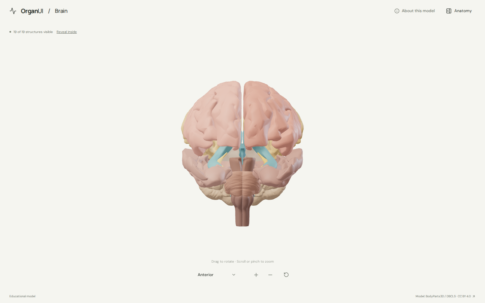
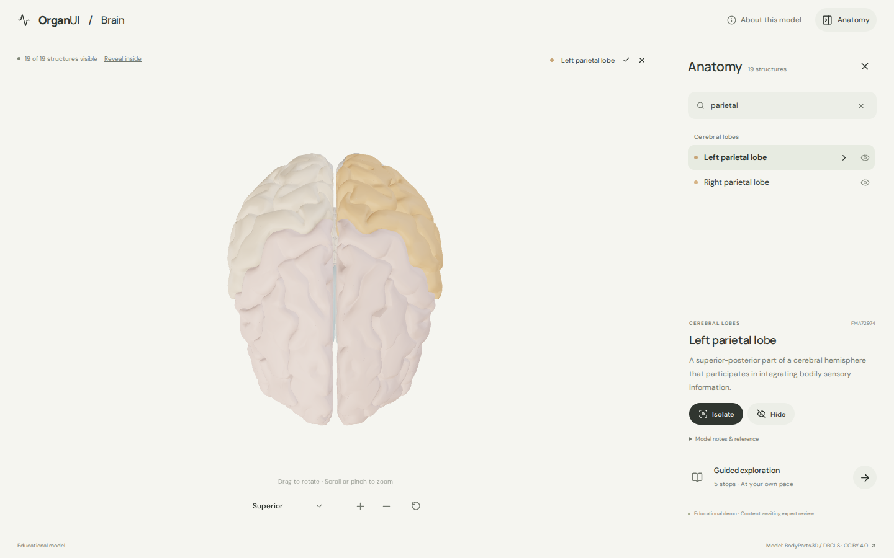
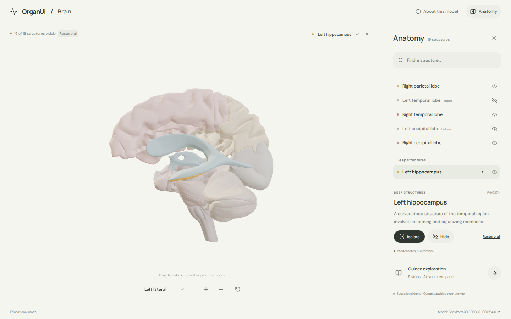
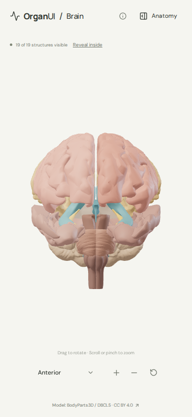

# OrganUI Brain

A focused, open-source 3D brain anatomy explorer from [OrganUI](https://github.com/organui). It is a standalone React application: no sibling checkout, monorepo package, or remote runtime service is required.

**Review deployment:** [brain-3d-beta.vercel.app](https://brain-3d-beta.vercel.app/) (Vercel team access may be required while deployment protection is enabled).



## What works

- Rotate, pinch/scroll, zoom buttons, reset, keyboard controls, and six named anatomical views. Manual rotation changes the label to **Custom view**.
- Nineteen selectable source-backed groups: bilateral frontal, parietal, temporal, and occipital lobes; bilateral hippocampi; cerebellum; midbrain, pons, and medulla; and five ventricular-space surfaces.
- Each named view is framed from the model's sampled surface, so the brain fills a similar share of the canvas from every side.
- Synchronized scene/list selection, search by name or FMA identifier, hide, isolate, and restore. Selecting a structure recedes the others toward the canvas tone so the selection reads from any view; a deep structure behind visible tissue stays occluded rather than drawn through it.
- **Reveal inside** hides the four left cerebral-lobe surface groups while preserving deeper structures in their original alignment. It is a visibility reveal, not a cut surface or medical image.
- A five-stop guided exploration that includes the supported reveal and reliably returns to the anterior overview.
- Initially collapsed anatomy panel, mobile layout, reduced-motion handling, keyboard-accessible controls, loading progress, missing-model recovery, and a text alternative when 3D is unavailable.





## Run locally

[Bun](https://bun.com/) 1.4.2 is recorded in `package.json`.

```bash
bun install --frozen-lockfile
bun run dev
```

Open the local URL printed by Vite. Other useful commands:

```bash
bun test
bun run typecheck
bun run build
bun run verify:model
```

To reproduce the runtime asset from the pinned BodyParts3D inputs:

```bash
bun run prepare:model
bun run verify:model
```

Raw downloads stay in ignored `.asset-cache/`; the script downloads them when absent, rejects changed upstream files by SHA-256, and writes the tracked GLB, manifest, and selected mapping table.

## Model scope and provenance

The model is derived from BodyParts3D 4.0’s 99% polygon-reduction IS-A OBJ archive and its PART-OF mapping table. The runtime groups 45 source element meshes into 19 selections without drawing compound whole-brain, whole-hemisphere, or whole-brainstem concepts over their constituent geometry. The cerebral aqueduct element is owned by the ventricular group and excluded from the compound midbrain selection to prevent duplication.

The source axes are transformed uniformly from `[x, y, z]` to display `[x, z, -y]`, preserving anatomical alignment. Source centroids confirm left structures at positive X and right structures at negative X; camera labels describe anatomical viewpoint, not screen position. See [model provenance](docs/MODEL_PROVENANCE.md), the [machine-readable manifest](public/models/manifest.json), and [selected source mappings](docs/model-source/selected-mappings.tsv).

## License and attribution

Original application code is licensed under [MIT](LICENSE). The anatomy model is separate:

> BodyParts3D, © The Database Center for Life Science licensed under CC Attribution 4.0 International.

See the [asset attribution and modification notice](public/models/ATTRIBUTION.md). Font and icon notices are in [`public/licenses/`](public/licenses/). The MIT license does not relicense the model, fonts, icons, or derived screenshots.

## Limitations and review status

This is an educational interface demonstration, not a diagnostic, patient-specific, MRI/DICOM, surgical-planning, tractography, neural-activity, or clinical-validation tool. Colors are illustrative. Ventricular meshes are solid surfaces representing cavity space rather than tissue or fluid imaging. The source is a reduced polygon model and omits anatomy outside the selected mappings; the app does not infer missing segmentation or fabricate cut surfaces.

Labels and element ownership were developer-checked against the pinned BodyParts3D mapping table. Concise explanations reference NINDS and OpenStax. Independent expert anatomical review and physical-device testing have not been performed. See [verification evidence](docs/VERIFICATION.md).


